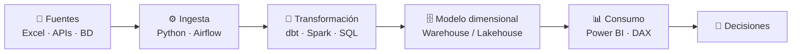

<!-- BANNER -->

  

<!-- TEXTO ANIMADO -->

  

  <a href="https://www.linkedin.com/in/<www.linkedin.com/in/juancamiloramirezchaverra>"></a>
  <a href="mailto:<camilo.jcrc098@gmail.com>"></a>
  
  

---

## 👨‍💻 Sobre mí

Soy ingeniero informático y me muevo en el punto donde los datos desordenados se vuelven algo útil. He trabajado en el sector público y en el privado, y en los dos me ha tocado lo mismo: agarrar información regada en Excel, correos y sistemas que no se hablan entre sí, y dejarla ordenada, confiable y lista para decidir.

Lo que he hecho hasta ahora:

- 🧱 Armar pipelines en **Azure Synapse y Microsoft Fabric**, moviendo los datos desde la capa bronce hasta plata y oro, listos para análisis.
- 📊 Construir **tableros y reportes paginados en Power BI**, con modelos y consultas DAX optimizados para que carguen rápido y los números cuadren.
- 🧹 Limpiar y validar datos (calidad, duplicados, reglas de negocio) antes de que lleguen a un tablero, porque un dashboard bonito con datos malos es peor que no tener dashboard.
- 🤖 Automatizar procesos manuales con **Python, Power Automate, Power Apps y VBA**. Sí, VBA también, porque a veces es la herramienta que la gente ya tiene instalada.
- 🚨 Diseñar tableros de control y alertas tempranas para equipos que antes se enteraban de los problemas cuando ya era tarde.

Me gusta que lo que construyo sobreviva a mi ausencia: que corra solo, que esté documentado y que alguien más pueda tocarlo sin miedo.

**Ahora mismo**

- 🎓 Haciendo la **especialización en Analítica de Datos**
- 📜 Preparando la certificación **DP-600 (Fabric Analytics Engineer)**
- 🌱 Metiéndole horas a **Airflow, dbt y Spark** con proyectos propios (varios de los repos de abajo salen de ahí)
- 💬 Pregúntame de: Power BI y DAX, modelado dimensional, ETL en Python, Fabric y automatización

---

## 🧰 Stack

**Lenguajes y datos**

  
  
  
  

**Ingeniería de datos**

  
  
  
  
  

**Nube y BI**

  
  
  
  

---

## 🏗️ Cómo construyo

Así se ve, en general, un flujo de datos de los que armo:

---

## 🚀 Proyectos destacados

| Proyecto | Qué resuelve | Stack |
|---|---|---|
| **[<repo-1>](https://github.com/<usuario>/<repo-1>)** | <problema en una línea> | Python · Airflow · dbt |
| **[<repo-2>](https://github.com/<usuario>/<repo-2>)** | <problema en una línea> | Spark · Delta |
| **[<repo-3>](https://github.com/<usuario>/<repo-3>)** | <problema
